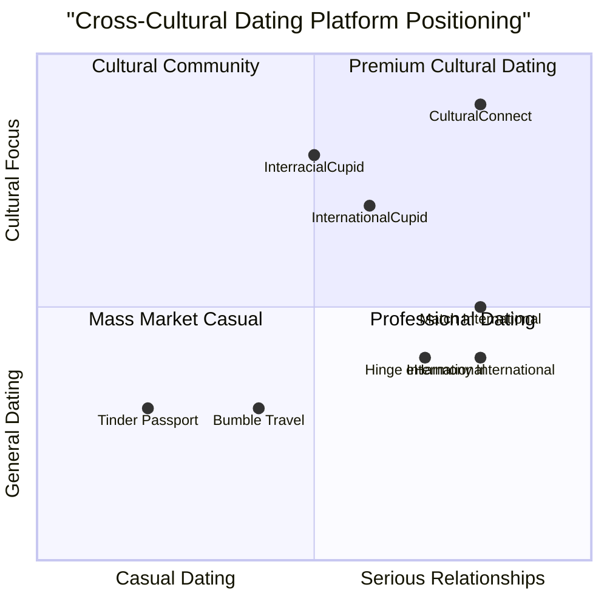

# Product Requirements Document (PRD)
# Cross-Cultural Dating Platform: CulturalConnect

## 1. Language & Project Information

**Language:** English  
**Programming Language:** Next.js (TypeScript), Node.js, PostgreSQL, Tailwind CSS  
**Project Name:** cultural_connect  
**Original Requirements:** Design and develop an end-to-end dating website focused on matchmaking between Americans and non-Americans, combining Tinder's dating functionality with LinkedIn's professional interface for cross-cultural interactions and potential long-term partnerships.

## 2. Product Definition

### 2.1 Product Goals

1. **Cultural Bridge Building**: Create meaningful connections between Americans and non-Americans through a premium dating platform that facilitates cross-cultural relationships and cultural exchange.

2. **Professional Dating Experience**: Establish a trustworthy, LinkedIn-style professional dating environment that attracts serious relationship seekers while avoiding the casual "hook-up app" perception.

3. **Scalable Community Platform**: Build a foundation for future expansion into immigration services, cultural content, and community events while maintaining core dating functionality.

### 2.2 User Stories

**As a non-American professional**, I want to connect with Americans who are genuinely interested in cross-cultural relationships so that I can find a meaningful partnership while potentially exploring immigration opportunities.

**As an American seeking cultural diversity**, I want to meet verified international singles through a professional platform so that I can expand my cultural horizons and find a serious relationship.

**As a premium subscriber**, I want AI-powered conversation starters and cultural insights so that I can have more meaningful conversations across cultural boundaries.

**As a community member**, I want to attend culturally-themed local events so that I can meet potential matches in person and learn about different cultures.

**As a user interested in immigration**, I want access to curated immigration-related news and resources so that I can stay informed about relevant legal and procedural information.

### 2.3 Competitive Analysis

Based on market research, here are the key competitors:

**1. InternationalCupid**
- *Pros*: Established international dating brand, translation features, large user base
- *Cons*: Outdated interface, limited cultural exchange features, reputation issues with authenticity

**2. eHarmony International**
- *Pros*: Serious relationship focus, comprehensive compatibility matching, trusted brand
- *Cons*: Expensive ($60+/month), limited cultural-specific features, older demographic

**3. Tinder Passport**
- *Pros*: Massive user base, global reach, familiar interface
- *Cons*: Casual dating reputation, limited cultural matching, high competition

**4. Bumble Travel Mode**
- *Pros*: Women-first approach, professional feel, video chat features
- *Cons*: Limited international focus, no cultural exchange emphasis, general dating app

**5. InterracialCupid**
- *Pros*: Cross-cultural focus, niche targeting, established user base
- *Cons*: Limited to interracial only, outdated design, basic features

**6. Hinge (International)**
- *Pros*: Relationship-focused, quality profiles, growing internationally
- *Cons*: Limited cultural features, expensive premium tiers, US-centric

**7. Match International**
- *Pros*: Large global presence, detailed profiles, serious dating focus
- *Cons*: High cost, complex interface, limited cultural exchange features

### 2.4 Competitive Quadrant Chart



## 3. Technical Specifications

### 3.1 Requirements Analysis

The CulturalConnect platform requires a sophisticated technical architecture to support:

- **User Authentication & Profile Management**: Secure registration with identity verification, comprehensive profile creation with cultural preferences
- **Advanced Matching Algorithm**: AI-powered matching based on cultural compatibility, geographic preferences, and relationship goals
- **Real-time Communication**: Instant messaging with AI conversation starters, translation support, video chat capabilities
- **Payment Processing**: Subscription management, secure payment gateway integration, billing automation
- **Content Management**: Dynamic feed system, event management, news curation, user-generated content
- **Mobile Responsiveness**: Progressive Web App (PWA) functionality, cross-platform compatibility
- **Scalability Infrastructure**: Microservices architecture, cloud deployment, database optimization
- **Security & Compliance**: Data protection, user verification, fraud prevention, GDPR compliance

### 3.2 Requirements Pool

#### P0 (Must-Have) Requirements

1. **User Registration & Authentication**
   - Email/phone verification system
   - American vs. Non-American classification
   - Nationality selection for non-Americans
   - Gender and orientation selection
   - Relationship goal specification
   - Geographic location via zip code
   - Payment wall implementation ($40/month, $400/year)

2. **Core Matching System**
   - Default matching logic (non-American men → American women)
   - Custom matching preferences override
   - Profile compatibility scoring
   - Search and discovery interface

3. **Profile Management**
   - Photo upload and verification
   - Bio and personal information
   - Mandatory "Cultural Journey" section
   - Interest and preference settings
   - Privacy controls

4. **Messaging System**
   - Real-time chat functionality
   - AI-powered conversation starters
   - Message history and management
   - Block and report features

5. **Payment Integration**
   - Stripe/PayPal integration
   - Subscription management
   - Billing automation
   - Payment security compliance

#### P1 (Should-Have) Requirements

1. **Dynamic Feed System**
   - Local event listings
   - Immigration news curation
   - User status updates
   - Sponsored content integration

2. **Event Management**
   - Cultural event creation and management
   - RSVP functionality
   - Event discovery and recommendations
   - Integration with local venues

3. **Enhanced Communication**
   - Video chat capabilities
   - Voice messages
   - Photo sharing in chat
   - Translation assistance

4. **User Verification**
   - Photo verification system
   - Identity document verification
   - Social media integration
   - Trust score system

5. **Mobile Optimization**
   - Responsive design
   - PWA functionality
   - Push notifications
   - Offline capability

#### P2 (Nice-to-Have) Requirements

1. **Advanced AI Features**
   - Personality compatibility analysis
   - Cultural compatibility scoring
   - Smart notification timing
   - Behavioral pattern analysis

2. **Community Features**
   - User forums and discussions
   - Cultural exchange programs
   - Mentorship matching
   - Success story sharing

3. **Content Platform**
   - Cultural education content
   - Immigration guides and resources
   - Blog and article system
   - Video content integration

4. **Analytics and Insights**
   - User behavior analytics
   - Matching success metrics
   - A/B testing framework
   - Performance monitoring

### 3.3 UI Design Draft

#### Main Navigation Structure
```
Header: Logo | Search | Messages | Events | Profile | Settings
Main Content Area: Feed/Matches/Discovery
Sidebar: Filters | Suggestions | Sponsored Content
Footer: Legal | Support | Social Links
```

#### Key Page Layouts

**Landing Page**
- Hero section with value proposition
- Feature highlights with cultural imagery
- Success stories and testimonials
- Pricing and subscription options

**Profile Page**
- Photo carousel with verification badges
- Personal information and preferences
- Cultural Journey section (prominent placement)
- Compatibility indicators
- Action buttons (Like, Message, Report)

**Discovery/Matching Interface**
- Card-based layout similar to Tinder
- Cultural compatibility indicators
- Quick action buttons
- Advanced filter sidebar

**Messaging Interface**
- Chat list with online indicators
- Individual chat windows
- AI conversation starter suggestions
- Media sharing capabilities

**Events Page**
- Calendar view of upcoming events
- Event cards with cultural themes
- RSVP and attendance tracking
- Event creation for verified users

### 3.4 Open Questions

1. **Identity Verification**: What level of identity verification is required for American vs. Non-American users? Should we require passport/visa documentation for non-Americans?

2. **Geographic Restrictions**: Should we limit matching to specific geographic regions or allow global matching? How do we handle users who travel frequently?

3. **Cultural Sensitivity**: How do we ensure cultural representations are accurate and respectful? Should we have cultural advisors for different regions?

4. **Immigration Legal Compliance**: What legal disclaimers are needed regarding immigration advice? Should we partner with immigration law firms?

5. **Content Moderation**: How do we moderate cultural discussions and prevent discrimination while maintaining authentic cultural exchange?

6. **Pricing Strategy**: Should pricing vary by geographic region considering economic differences? How do we handle currency conversion?

7. **Event Liability**: What insurance and liability considerations are needed for in-person events? How do we ensure event safety?

8. **Data Privacy**: How do we comply with international data privacy laws (GDPR, CCPA) while serving global users?

9. **Age Verification**: What age verification methods should we implement, especially for users from countries with different legal age requirements?

10. **Success Metrics**: How do we measure success beyond matches (cultural exchange, long-term relationships, immigration outcomes)?

## 4. Technical Architecture

### 4.1 Frontend Stack
- **Framework**: Next.js 14 with TypeScript
- **Styling**: Tailwind CSS with custom design system
- **State Management**: Zustand for client state
- **UI Components**: Shadcn/ui component library
- **Real-time**: Socket.io client for messaging
- **Forms**: React Hook Form with Zod validation
- **Testing**: Jest and React Testing Library

### 4.2 Backend Stack
- **Runtime**: Node.js with Express.js
- **Database**: PostgreSQL with Prisma ORM
- **Authentication**: NextAuth.js with JWT
- **File Storage**: AWS S3 for media files
- **Real-time**: Socket.io for chat functionality
- **Payment**: Stripe for subscription management
- **Email**: SendGrid for transactional emails
- **Caching**: Redis for session and data caching

### 4.3 Infrastructure
- **Hosting**: Vercel for frontend, AWS EC2 for backend
- **Database**: AWS RDS PostgreSQL
- **CDN**: Cloudflare for global content delivery
- **Monitoring**: Sentry for error tracking
- **Analytics**: Google Analytics 4 and Mixpanel
- **CI/CD**: GitHub Actions for deployment pipeline

## 5. Success Metrics

### 5.1 Key Performance Indicators (KPIs)

**User Acquisition**
- Monthly Active Users (MAU)
- User registration conversion rate
- Cost per acquisition (CPA)
- Organic vs. paid user ratio

**Engagement Metrics**
- Daily active users (DAU)
- Average session duration
- Messages sent per user per day
- Profile completion rate

**Revenue Metrics**
- Monthly recurring revenue (MRR)
- Customer lifetime value (CLV)
- Churn rate
- Conversion from free to paid

**Matching Success**
- Match rate per user
- Conversation initiation rate
- Response rate to messages
- Long-term relationship formation

**Cultural Exchange Goals**
- Cross-cultural match percentage
- Event attendance rates
- Cultural content engagement
- User satisfaction with cultural learning

### 5.2 Success Criteria

**Phase 1 (MVP - 3 months)**
- 1,000 registered users
- 100 paying subscribers
- 70% profile completion rate
- 40% message response rate

**Phase 2 (Growth - 6 months)**
- 10,000 registered users
- 1,000 paying subscribers
- 50+ successful matches leading to relationships
- 20+ cultural events hosted

**Phase 3 (Scale - 12 months)**
- 50,000 registered users
- 5,000 paying subscribers
- $200K monthly recurring revenue
- Expansion to 5 major US cities

## 6. Risk Assessment

### 6.1 Technical Risks
- **Scalability challenges** with rapid user growth
- **Security vulnerabilities** in payment and user data
- **Real-time messaging** performance under load
- **Mobile performance** optimization needs

### 6.2 Business Risks
- **Regulatory compliance** with international dating laws
- **Cultural sensitivity** issues and potential backlash
- **Competition** from established dating platforms
- **User acquisition costs** in competitive market

### 6.3 Mitigation Strategies
- Implement robust testing and monitoring systems
- Partner with legal experts for compliance
- Establish cultural advisory board
- Focus on unique value proposition and user experience
- Develop strong brand identity and marketing strategy

## 7. Timeline and Milestones

### Phase 1: MVP Development (Months 1-3)
- Core user registration and profile system
- Basic matching algorithm
- Messaging functionality
- Payment integration
- Mobile-responsive design

### Phase 2: Enhanced Features (Months 4-6)
- AI conversation starters
- Event management system
- Advanced matching preferences
- User verification system
- Content feed implementation

### Phase 3: Community and Scale (Months 7-12)
- Cultural events platform
- Advanced analytics
- Community features
- Immigration content integration
- Multi-city expansion

This PRD serves as the foundation for developing CulturalConnect, a premium cross-cultural dating platform that bridges cultural boundaries while maintaining professional standards and focusing on meaningful relationships.